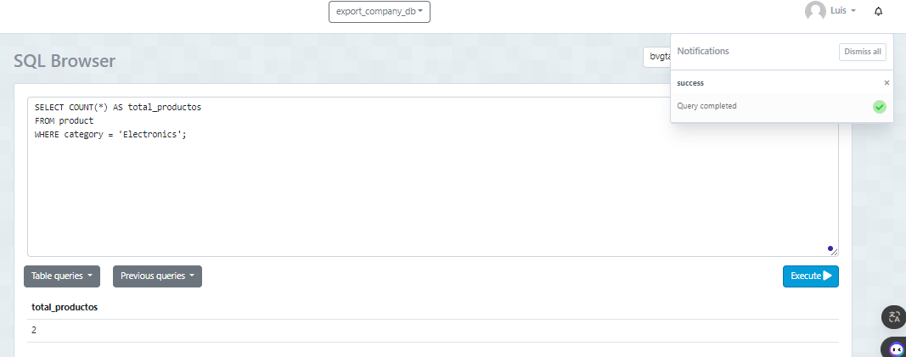
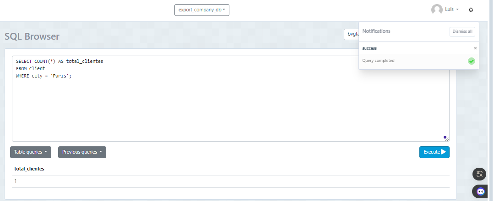
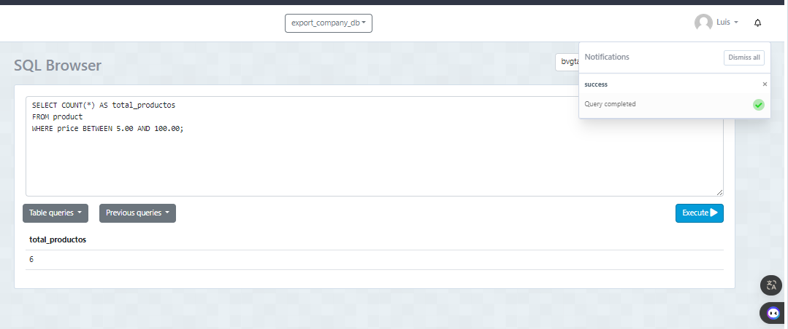
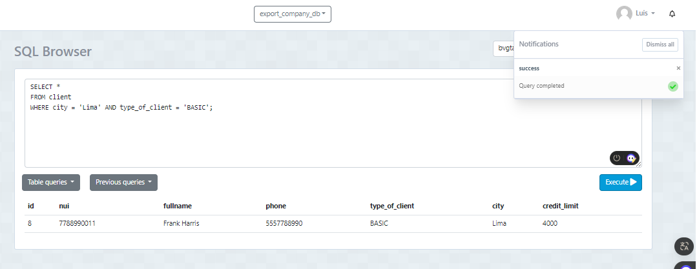
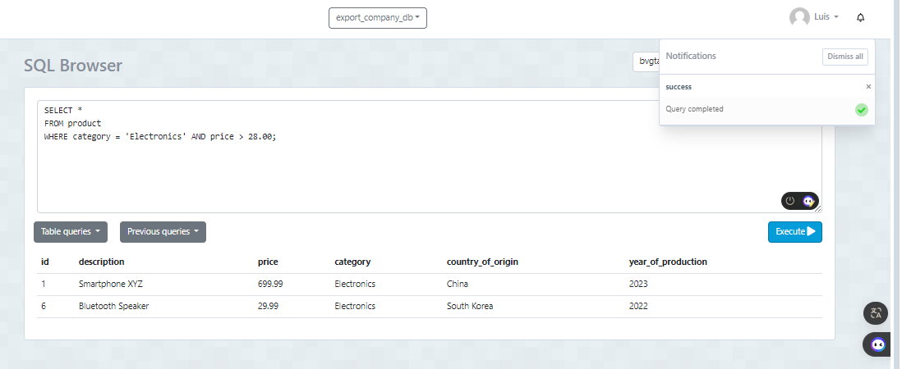
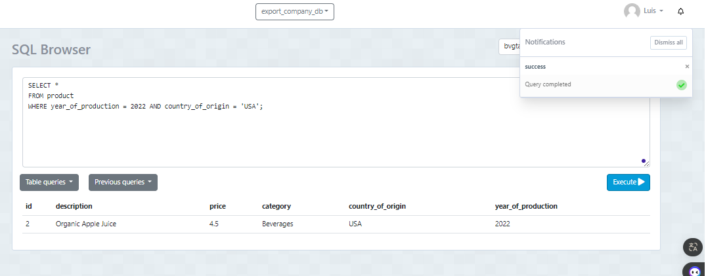
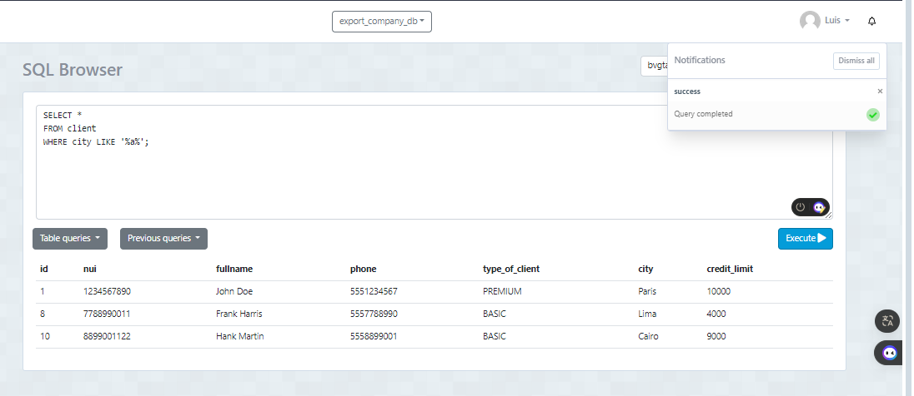

# TAS8 - Sentencias where multicriterio

## Creación de la tablas

### El siguiente código genera la tabla **client**:
```sql
CREATE TABLE client (
    id SERIAL,
    nui VARCHAR (10) NOT NULL,
    fullname VARCHAR (100) NOT NULL,
    phone VARCHAR (10),
    type_of_client VARCHAR (10) DEFAULT 'BASIC',
    city VARCHAR (10), 
    credit_limit DECIMAL(7,2),
    PRIMARY KEY (id)
);
```
### El siguiente código genera la tabla **product**:
```sql
CREATE TABLE product (
  id SERIAL,
  description VARCHAR(255) NOT NULL,
  price DECIMAL(10, 2) NOT NULL,
  category VARCHAR(100) NOT NULL,
  country_of_origin VARCHAR(100),
  year_of_production INT,
  PRIMARY KEY (id)
);
```
### Insertar Datos de la tabla **client**
 ```sql
 INSERT INTO client (nui, fullname, phone, type_of_client, city, credit_limit) VALUES
('1234567890', 'John Doe', '5551234567', 'PREMIUM', 'Paris', 10000.00),
('0987654321', 'Jane Smith', '5557654321', 'BASIC', 'Rome', 5000.00),
('1122334455', 'Alice Johnson', '5551122334', 'GOLD', 'Tokyo', 15000.00),
('5566778899', 'Bob Brown', '5555566778', 'BASIC', 'Sydney', 7000.00),
('2233445566', 'Charlie Davis', '5552233445', 'SILVER', 'Berlin', 8000.00),
('6677889900', 'David Wilson', '5556677889', 'BASIC', 'Moscow', 6000.00),
('3344556677', 'Eve Miller', '5553344556', 'PREMIUM', 'Oslo', 11000.00),
('7788990011', 'Frank Harris', '5557788990', 'BASIC', 'Lima', 4000.00),
('4455667788', 'Grace Clark', '5554455667', 'GOLD', 'Rio', 12000.00),
('8899001122', 'Hank Martin', '5558899001', 'BASIC', 'Cairo', 9000.00);

```
### Insertar Datos de la tabla **product**
```sql
INSERT INTO product (description, price, category, country_of_origin, year_of_production) VALUES
('Smartphone XYZ', 699.99, 'Electronics', 'China', 2023),
('Organic Apple Juice', 4.50, 'Beverages', 'USA', 2022),
('Leather Wallet', 49.99, 'Accessories', 'Italy', 2021),
('Electric Kettle', 35.00, 'Home Appliances', 'Germany', 2020),
('Mountain Bike', 899.95, 'Sports', 'Canada', 2023),
('Bluetooth Speaker', 29.99, 'Electronics', 'South Korea', 2022),
('Yoga Mat', 19.99, 'Fitness', 'India', 2021),
('Running Shoes', 120.00, 'Footwear', 'Vietnam', 2023),
('LED Desk Lamp', 25.75, 'Office Supplies', 'Japan', 2020),
('Wireless Mouse', 14.99, 'Computers', 'Malaysia', 2021);

```
## 1) Contar el número de productos de una categoría específica.
####  Utiliza la función COUNT(*) para contar el número de filas que cumplen con esa condición y lo nombra como "total_productos" utilizando la cláusula AS. Es útil para obtener rápidamente la cantidad de productos dentro de una categoría específica en una base de datos.
```sql
SELECT COUNT(*) AS total_productos
FROM product
WHERE category = 'Electronics';
```


## 2) Contar el número de clientes en una ciudad específica.
#### Cuenta cuántos clientes están registrados en la tabla "client" que tienen su ciudad establecida como 'Paris'. Utiliza la función COUNT(*) para contar el número de filas que cumplen con esa condición y lo nombra como "total_clientes" utilizando la cláusula AS
```sql
SELECT COUNT(*) AS total_clientes
FROM client
WHERE city = 'Paris';
```


## 3) Contar el número de productos cuyo precio está dentro de un rango específico  
#### Se utiliza para contar cuántos registros en la tabla "product" tienen un precio que está entre 5.00 y 100.00. La condición WHERE price BETWEEN 5.00 AND 100.00 filtra los registros para incluir solo aquellos cuyos precios están dentro de este rango.

```sql
SELECT COUNT(*) AS total_productos
FROM product
WHERE price BETWEEN 5.00 AND 100.00;
```


## 4) Seleccionar clientes que viven en una ciudad específica y tienen un tipo de cliente específico
#### La consulta en la tabla "client" para seleccionar todos los campos de los clientes que están ubicados en la ciudad de 'Lima' y tienen un tipo de cliente 'BASIC'. Esto significa que se están buscando clientes que residan en Lima y tengan un nivel de membresía básico
```sql
SELECT *
FROM client
WHERE city = 'Lima' AND type_of_client = 'BASIC';
```


## 5) Seleccionar productos que pertenecen a una categoría específica y cuyo precio está por encima de un valor específico 
#### "product" donde la categoría (category) es 'Electronics' y el precio (price) es mayor que 28.00. Esto significa que se están buscando productos electrónicos que tengan un precio superior a 28.00 unidades monetarias
```sql
SELECT *
FROM product
WHERE category = 'Electronics' AND price > 28.00;
```


## 6) Seleccionar productos que fueron producidos en un año específico y en un país de origen específico
#### La tabla "product" donde el año de producción es 2022 y el país de origen es Estados Unidos. En resumen, filtra y muestra los productos fabricados en Estados Unidos en el año 2022. 
```sql
SELECT *
FROM product
WHERE year_of_production = 2022 AND country_of_origin = 'USA';
```


## 7) Seleccionar clientes cuyo nombre completo comience con 'J'.
#### (fullname) comienza con la letra 'J'. Utiliza el operador LIKE con el patrón 'J%', donde '%' es un comodín que representa cualquier secuencia de caracteres después de la 'J'.
```sql
SELECT *
FROM client
WHERE fullname LIKE 'J%';
```


## 8) Seleccionar clientes cuya ciudad contenga la letra 'a'
#### Donde el nombre de la ciudad (city) contiene la letra 'a' en cualquier posición. El operador LIKE con el patrón '%a%' permite buscar cualquier ciudad que tenga la letra 'a' en cualquier parte de su nombre. Esto es útil para encontrar clientes que residan en ciudades que contengan la letra 'a', sin importar si está al principio, en medio o al final del nombre de la ciudad.
```sql
SELECT *
FROM client
WHERE city LIKE '%a%';
```


